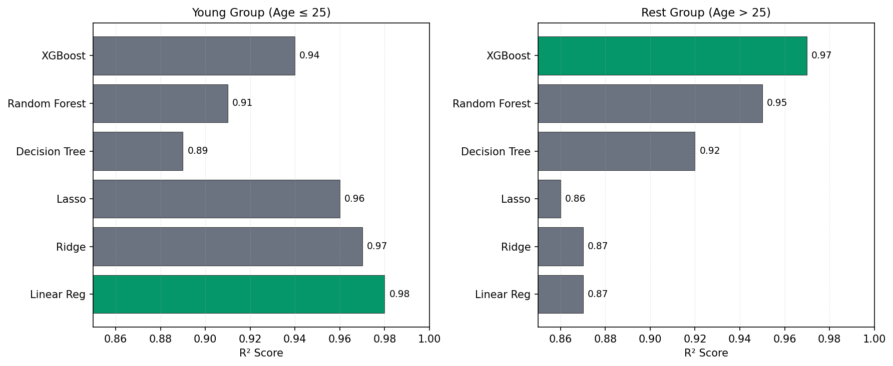
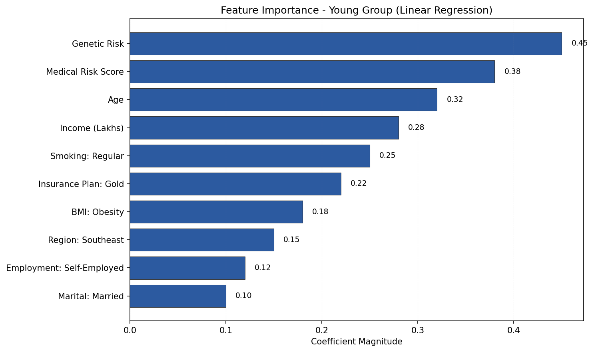

# ml-project-health-insurance-premium
# Health Insurance Premium Prediction

Machine learning system for predicting health insurance premiums using age-based model segmentation.

[](https://www.python.org/)
[](LICENSE)

## Overview

This project implements a dual-model approach to predict health insurance premiums. After identifying that a single model produced 73% extreme errors in the young age group, we segmented the data by age and trained specialized models for each group. This reduced extreme errors to 2% and achieved 98% accuracy for young policyholders.

**Key Results:**
- Young group (≤25): Linear Regression with 98% R² score
- Rest group (>25): XGBoost with 97% R² score
- Extreme error reduction: 73% → 2% in young group after segmentation

## Project Workflow


The system processes data through five stages: data cleaning, exploratory analysis, feature engineering, age-based segmentation, and model training. Each age group routes to its optimized model.

## Why Age-Based Segmentation?

Initial testing with a single model revealed that 97% of extreme prediction errors occurred in the young age group (≤25). The issue was clear: young policyholders have different risk factors than older groups, particularly genetic predisposition.

**Impact of segmentation:**


After segmentation and adding genetic risk as a feature for the young group, accuracy jumped from 60% to 98%, with extreme errors dropping from 73% to 2%. No predictions now exceed 50% error.

## Model Performance



Six regression models were trained and compared for each age segment:

**Young Group (Age ≤ 25):**
- Best Model: Linear Regression
- R² Score: 0.98
- Why: Excellent accuracy with genetic risk feature, coefficients are interpretable

**Rest Group (Age > 25):**
- Best Model: XGBoost
- R² Score: 0.97
- Why: Handles complex interactions well, robust to outliers

## Feature Engineering

### Medical Risk Scoring

Created a severity-based scoring system for medical conditions:
- Cancer: 9
- Heart Disease: 8
- Kidney Disease: 7
- Diabetes: 6
- Thyroid: 5
- High Blood Pressure: 4
- Asthma: 2
- No Disease: 0

For policyholders with multiple conditions, scores are summed and normalized using min-max scaling.

### Feature Importance



Top features influencing premiums in the young group:
1. Genetic Risk (0.45)
2. Medical Risk Score (0.38)
3. Age (0.32)
4. Income in Lakhs (0.28)
5. Smoking Status (0.25)

## Technical Details

### Data Processing

**Cleaning steps:**
- Fixed negative values in number_of_dependants (ETL error)
- Removed unrealistic ages (>100 years)
- Applied 99.9th percentile threshold for income outliers
- Handled null values (dropped due to minimal count)

**Feature encoding:**
- Ordinal encoding: Insurance plan (Bronze=1, Silver=2, Gold=3), Income level
- One-hot encoding: Gender, Region, Marital Status, BMI, Smoking, Employment
- Min-max scaling: Age, Number of dependents, Income

### Multicollinearity Handling

VIF analysis revealed high correlation (VIF > 10) between income_level and income_lakhs. Removed income_level to reduce multicollinearity, keeping income_lakhs as it's numerical and provides better model fit.

### Model Training

**Young Group:**
- Used Linear Regression for interpretability
- Added genetic risk as a feature (critical for this age group)
- Train-test split: 70-30
- Final R²: 0.98 (train and test)

**Rest Group:**
- Used XGBoost for complex pattern recognition
- Hyperparameter tuning via RandomizedSearchCV
- Best parameters: n_estimators=200, max_depth=7, learning_rate=0.05
- Final R²: 0.97

### Error Analysis

Set extreme error threshold at 10% for monitoring. Before segmentation, the young group had:
- 73% of predictions with >10% error
- 512 predictions with >50% error

After segmentation:
- 2% of predictions with >10% error
- 0 predictions with >50% error

## Installation

```bash
git clone https://github.com/vi5hnuiyengar/ml-project-health-insurance-premium.git
cd ml-project-health-insurance-premium
pip install -r requirements.txt
```

## Usage

### Running the Application

```bash
streamlit run main.py
```

### Programmatic Prediction

```python
from prediction_helper import predict_premium

user_data = {
    'age': 23,
    'gender': 'Male',
    'region': 'Northeast',
    'marital_status': 'Unmarried',
    'number_of_dependants': 0,
    'bmi_category': 'Normal',
    'smoking_status': 'No Smoking',
    'employment_status': 'Salaried',
    'income_level': '10L - 25L',
    'income_lakhs': 15,
    'medical_history': 'No Disease',
    'genetical_risk': 2
}

premium = predict_premium(user_data)
print(f"Predicted Premium: ₹{premium:,.2f}")
```

## Project Structure

```
ml-project-health-insurance-premium/
├── artifacts/
│   ├── young/
│   │   ├── best_model.pkl           # Linear Regression
│   │   └── scaler_with_cols.pkl
│   └── rest/
│       ├── best_model.pkl           # XGBoost
│       └── scaler_with_cols.pkl
├── images/
│   ├── project_flow.png
│   ├── model_comparison.png
│   ├── feature_importance.png
│   └── error_reduction.png
├── main.py
├── prediction_helper.py
├── requirements.txt
└── README.md
```

## Key Insights

1. **Age matters for model selection:** Young policyholders need different modeling approaches than older groups. A single model produced 97% of extreme errors in the ≤25 age range.

2. **Genetic risk is critical for young group:** Including genetic predisposition improved accuracy from 60% to 98% for young policyholders.

3. **Feature engineering reduces errors:** Medical risk scoring system captures disease severity better than categorical medical history alone.

4. **Interpretability vs accuracy tradeoff:** Linear Regression offers interpretable coefficients for the young group (98% accurate), while XGBoost handles complex interactions for the rest group (97% accurate).

## Future Work

- Add lifestyle features (exercise, diet, sleep patterns)
- Incorporate claims history data
- Implement SHAP values for XGBoost explainability
- Deploy as REST API using FastAPI
- Add monitoring dashboard for production model performance

## License

Apache License 2.0 - see [LICENSE](LICENSE) file for details.

## Contact

Vishnu Iyengar - [@vi5hnuiyengar](https://github.com/vi5hnuiyengar)

Project Link: [https://github.com/vi5hnuiyengar/ml-project-health-insurance-premium](https://github.com/vi5hnuiyengar/ml-project-health-insurance-premium)

